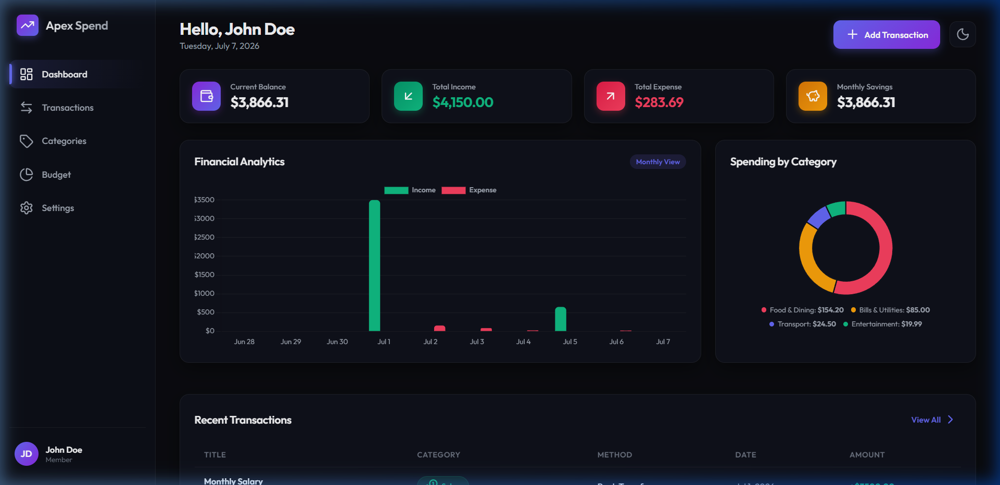
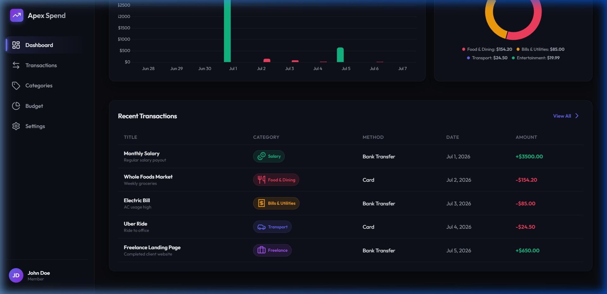
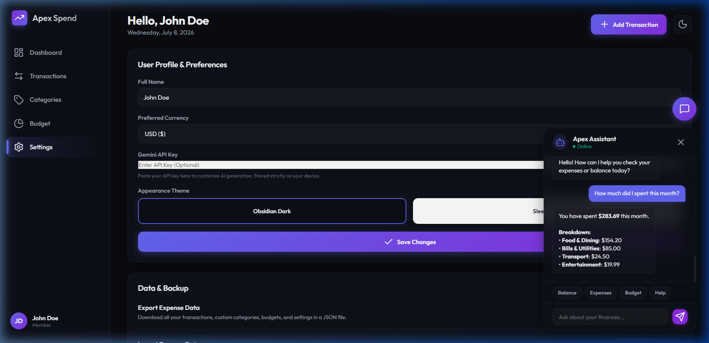

# Apex Spend - Premium Expense Tracker

Apex Spend is a high-fidelity, lightweight Single Page Application (SPA) designed to help users track personal budgets, log income and expenses, manage categories, and analyze monthly spending habits.

Live website deployed on Vercel:
🔗 **[https://expense-tracker-pi-mauve-79.vercel.app](https://expense-tracker-pi-mauve-79.vercel.app)**

## Features

- **OBSIDIAN DARK & SLEEK LIGHT THEMES**: Instantly swap between themes via a dedicated toggle in the header.
- **KPI METRIC TILES**: Dynamic balances, monthly savings, total income, and total expenses calculated reactively.
- **CHART.JS ANALYTICS**: Grouped bar charts showing Daily Trends and doughnut charts showing Category Distributions.
- **FULL TRANSACTION FILTERING**: Search matching titles, categories, payment methods, or type instantly.
- **GLOWING BUDGET TARGET ALERTS**: Configure monthly expense budgets. Turns Amber at 80% usage and Red at 100% with warning banners.
- **CHATBOT ASSISTANT**: A professional, floating assistant widget helping you ask natural queries about balance, expenses, budget, and savings.
- **JSON MAINTENANCE**: Export all transaction and profile data to a JSON backup, or import to restore a state.

## Folder Structure

```plain text
expense-tracker/
│
├── docs/                      # Project Documentation
│   ├── PRD.md                 # Product Requirements
│   ├── TDD.md                 # Technical Design
│   ├── implementation_plan.md # Development milestones
│   └── walkthrough.md         # Final validation details
│
├── index.html                 # App Layout
├── styles.css                 # Custom Styling
├── app.js                     # State Controller
└── walkthrough.md             # Walkthrough report with visuals
```

## Running Locally

To run the application locally, you can open `index.html` directly in any web browser, or serve it using any simple local server:

```bash
# Using Python
python -m http.server 8000

# Using Node.js
npx serve
```

## Visual Walkthrough

Here is the application's main interface and layout:

### 1. Dashboard View (Obsidian Dark Theme)
The landing view contains interactive Chart.js summaries and reactive financial KPIs.


### 2. Full Dashboard Overview
Shows historical transaction grids and category metrics.


### 3. Chatbot Assistant View
The floating financial assistant handles natural queries and quick actions.


### 4. Verification Recordings
You can watch the automated validation runs:
- **General Verification Flow**:
  
- **Chatbot Verification Flow**:
  

